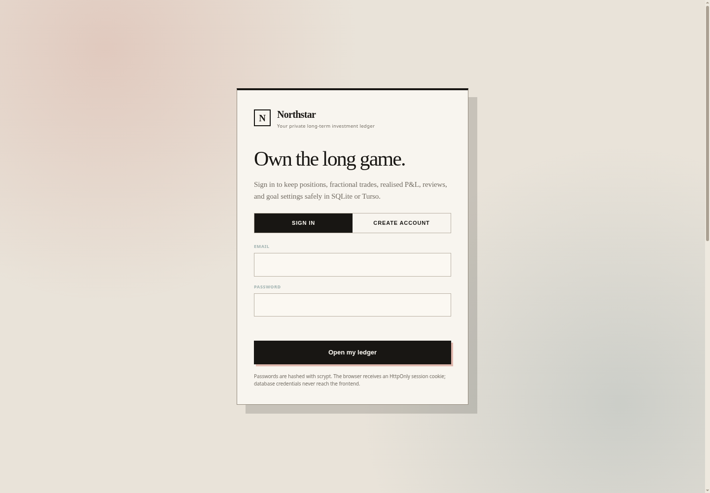

# Northstar Portfolio OS



A private, open-source ETF portfolio ledger for long-term investors. Northstar tracks fractional positions, weighted average cost, realised and unrealised P&L, Xetra quotes, allocation drift, benchmark comparisons, goal projections, and quarterly reviews.

The default portfolio is configured for:

- **BCFP** — UBS Nasdaq-100 UCITS ETF USD Acc
- **SEC0** — iShares MSCI Global Semiconductors UCITS ETF
- **EMSM** — Invesco MSCI Emerging Markets UCITS ETF Acc

> Northstar is a personal tracking tool. It is not a broker, tax engine, trading system, or investment adviser.

## Highlights

- Modern Ledger editorial interface
- Secure email/password login
- HttpOnly database-backed sessions
- Local SQLite development with zero configuration
- Turso/libSQL production support
- Normalised transaction table plus portfolio-state persistence
- Fractional shares and weighted average entry prices
- Optional realised P&L override for sell transactions
- Official Xetra last-trade valuation path
- Animated portfolio and benchmark charts
- Allocation drift and contribution-based rebalancing
- €100k goal ETA and an interactive “one extra decision” slider
- JSON export/import for portable backups
- Docker, Render, and GitHub Actions configuration

## Architecture

```text
Browser
  ├─ Modern Ledger UI
  ├─ localStorage cache (fast/offline fallback)
  └─ same-origin JSON API
       ├─ Flask authentication + sessions
       ├─ Portfolio state API
       ├─ Normalised trade storage
       ├─ Xetra quote proxy
       └─ SQLite locally / Turso in production
```

The database is the canonical source after login. The browser keeps a local cache so the UI remains fast and can recover from a temporary connection failure.

## Quick start on macOS

### Easiest

1. Download or clone this repository.
2. Double-click `start_northstar.command`.
3. Northstar creates `.venv`, installs dependencies, selects a free port, and opens the browser.
4. Create your account.

Local data is stored in:

```text
data/northstar.db
```

### Python 3.14 and Turso dependencies

The default local install intentionally uses standard SQLite and contains no Rust/native libSQL dependency. This makes `start_northstar.command` compatible with Python 3.14.

Turso support is an optional production dependency:

```bash
pip install -r requirements-turso.txt
```

The included Docker and Render configurations use Python 3.13 and install this Turso dependency automatically. If you are running Python 3.14 locally, keep `TURSO_DATABASE_URL` unset and use the built-in SQLite database at `data/northstar.db`.

If an older Northstar download left a partially installed `.venv`, the updated launcher detects and repairs it. To reset it manually:

```bash
rm -rf .venv
./start_northstar.command
```

### Terminal

```bash
python3 -m venv .venv
source .venv/bin/activate
pip install -r requirements.txt
cp .env.example .env
python scripts/dev.py
```

## Where transactions are stored

Each trade is stored twice for resilience:

1. **Canonical database record** in the `trades` table, scoped to the logged-in user.
2. **Browser cache** in `localStorage` under `northstarPortfolio`.

The database also stores portfolio settings, baseline positions, reviews, snapshots, and goal assumptions. Market quotes are refreshed from the provider and cached in the portfolio state for display continuity.

The browser cache is not a substitute for backups. Use **Settings → Export JSON** periodically.

## Configure Turso

Northstar uses normal SQLite locally and the same SQL model with Turso Cloud in production.

### 1. Install and authenticate the Turso CLI

Follow the official Turso installation instructions, then:

```bash
turso auth login
```

### 2. Create a database

```bash
turso db create northstar
turso db show --url northstar
turso db tokens create northstar
```

### 3. Add environment variables

```env
TURSO_DATABASE_URL=libsql://your-database-your-org.turso.io
TURSO_AUTH_TOKEN=your-token
SESSION_SECRET=a-long-random-value
COOKIE_SECURE=true
ALLOW_REGISTRATION=true
```

Generate a session secret:

```bash
python -c "import secrets; print(secrets.token_urlsafe(48))"
```

After creating your own account on a public deployment, set:

```env
ALLOW_REGISTRATION=false
```

This turns the deployment into a private single-user app while preserving login.

## Deploy to Render

Render is the simplest deployment target for the included Flask server and quote proxy.

1. Push the repository to GitHub.
2. Create a Turso database and token using the steps above.
3. In Render, choose **New → Blueprint** and select the repository.
4. Render reads `render.yaml` automatically.
5. Add `TURSO_DATABASE_URL` and `TURSO_AUTH_TOKEN` when prompted.
6. Deploy.
7. Create your account, then set `ALLOW_REGISTRATION=false` and redeploy.

The health endpoint is:

```text
/health
```

## Deploy with Docker

```bash
docker build -t northstar .
docker run --rm -p 8000:8000 \
  -e SESSION_SECRET="$(python -c 'import secrets; print(secrets.token_urlsafe(48))')" \
  -e TURSO_DATABASE_URL="libsql://..." \
  -e TURSO_AUTH_TOKEN="..." \
  -e COOKIE_SECURE=false \
  northstar
```

Open `http://localhost:8000`.

## Authentication and security

- Passwords are hashed with Python `hashlib.scrypt` and a random salt.
- Session cookies are HttpOnly, SameSite=Lax, and Secure in HTTPS production.
- Only a SHA-256 hash of each session token is stored in the database.
- Write API requests reject cross-origin origins.
- Security headers include CSP, frame denial, MIME sniffing protection, and a restricted Permissions Policy.
- Authentication attempts are rate-limited in memory.
- Obsolete market-provider API keys are stripped before portfolio state is persisted.

For a public multi-user product, add email verification, password reset, persistent distributed rate limiting, audit logs, and an external security review.

## Database schema

Core tables:

- `users`
- `auth_sessions`
- `portfolio_state`
- `trades`

The schema is documented in `schema.sql`. SQLAlchemy creates missing tables automatically at startup. Local SQLite support is part of Python; the optional Turso SQLAlchemy dialect is installed only in production through `requirements-turso.txt`.

## Development

```bash
pip install -r requirements-dev.txt
pytest
ruff check northstar tests scripts
```

### Project layout

```text
northstar-portfolio/
├── northstar/
│   ├── __init__.py
│   ├── auth.py
│   ├── db.py
│   ├── market_api.py
│   ├── market_provider.py
│   ├── models.py
│   ├── security.py
│   └── state_api.py
├── static/index.html
├── scripts/
├── tests/
├── docs/
├── schema.sql
├── requirements.txt
├── requirements-turso.txt
├── Dockerfile
├── render.yaml
└── start_northstar.command
```

## Data migration from an older browser-only Northstar build

After your first login, Northstar checks the existing `northstarPortfolio` browser cache. If the database is empty and the local cache contains holdings or transactions, it imports that state automatically.

For moving between domains or browsers:

1. Export JSON from the old installation.
2. Open the new installation and sign in.
3. Import the JSON from Settings.
4. Wait for the header status to show **Saved to Turso** or **Saved to SQLite**.

## Market data note

The portfolio values use the official Xetra last-trade path exposed through the server-side market proxy. Benchmark and chart history may use a separate historical source. Exchange quotes can be delayed and can differ from broker-indicative or ask prices.

## Contributing

Contributions are welcome. Read [CONTRIBUTING.md](CONTRIBUTING.md) and [SECURITY.md](SECURITY.md) before opening a pull request or reporting a vulnerability.

## License

MIT © 2026 Shubham Kumar
