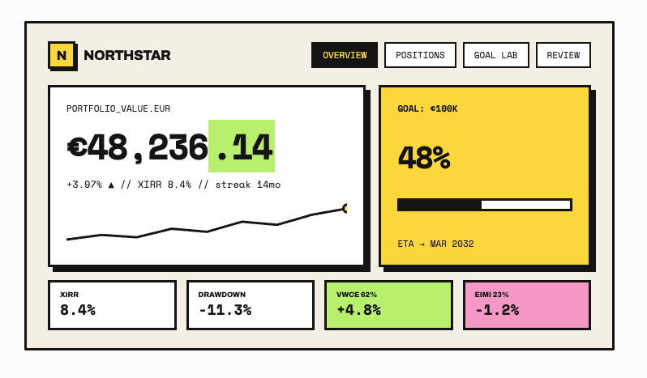

<div align="center">

# ⭐ Northstar

**A private, self-hosted portfolio ledger for long-term European ETF investors.**

Track fractional positions, XIRR, allocation drift, and your path to €100k —
across any ETF listed on 34 European exchanges, normalised to EUR. You can also add more ETFs to the catalog that are not listed.

[](.github/workflows/ci.yml)
[](LICENSE)



</div>

> **Disclaimer** — Northstar is a personal tracking tool. It is not a broker, tax
> engine, trading system, or investment adviser. Every projection it draws is a
> mathematical illustration, not a promise.

---

## Why Northstar

Most portfolio trackers are built for traders. Northstar is built for people who
buy the same ETFs every month for a decade. It answers three questions, honestly:

1. **Where am I?** — live EUR value, realised + unrealised P&L, money-weighted
   XIRR from your exact cash flows.
2. **Am I on plan?** — allocation drift against permanent targets, with
   contribution-based rebalancing that never tells you to sell.
3. **When do I get there?** — goal ETA, a 10,000-path Monte Carlo fan, and the
   probability of hitting €100k by your target date.

## Features

| | |
|---|---|
| 🗂️ **Open ETF catalog** | Search by name, ticker, or ISIN across 34 European venues, or add any exchange symbol directly |
| 💶 **EUR normalisation** | GBP, CHF, SEK… listings converted so every position is comparable |
| 📈 **Market data, no API key** | Delayed quotes via Yahoo Finance with a Stooq fallback; optional free [Twelve Data](https://twelvedata.com) key for real-time |
| 🧮 **Honest accounting** | Fractional shares, weighted average cost, realised P&L (with optional broker override), per-fund and portfolio XIRR |
| 🎯 **Goal Lab** | €100k ETA, "one extra decision" slider, milestone dates, compounding map, DCA backtest vs Nasdaq-100 and S&P 500 |
| 🎲 **Monte Carlo** | 10,000 lognormal paths calibrated to your portfolio's realised volatility, with a percentile fan chart |
| 🔐 **Private by design** | Email/password auth, HttpOnly database-backed sessions, account-scoped data, JSON export/import backups |
| 🗄️ **Zero-config storage** | Plain SQLite locally; [Turso](https://turso.tech)/libSQL in production with the same schema |

## Quick start

**Requirements:** Python 3.11+ (3.14 works — the local profile has no native
libSQL dependency).

```bash
git clone https://github.com/imskr/northstar.git
cd northstar
make install   # creates .venv and installs dev dependencies
make init-db   # creates data/northstar.db from schema.sql
make dev       # starts http://127.0.0.1:8000 and loads .env
```

Or without Make:

```bash
python3 -m venv .venv && source .venv/bin/activate
pip install -r requirements.txt
python scripts/init_db.py
python scripts/dev.py
```

**macOS one-click:** double-click `start_northstar.command`. It creates the
virtualenv, installs dependencies, picks a free port, and opens your browser.

Create your account, add the ETFs you actually own, and press **Sync**.

## Configuration

Copy `.env.example` to `.env`. Everything runs with defaults; the notable knobs:

| Variable | Default | Purpose |
|---|---|---|
| `SESSION_SECRET` | *(dev value)* | Cookie signing key — set a long random string in production |
| `ALLOW_REGISTRATION` | `true` | Set `false` after signup to lock a public deployment to existing accounts |
| `COOKIE_SECURE` | `false` | Set `true` when served over HTTPS |
| `TWELVE_DATA_API_KEY` | *(unset)* | Enables real-time quotes; otherwise delayed Yahoo/Stooq data is used |
| `TURSO_DATABASE_URL` / `TURSO_AUTH_TOKEN` | *(unset)* | Switch persistence from local SQLite to Turso cloud |
| `NORTHSTAR_DB_PATH` | `data/northstar.db` | Override the local SQLite location |

The full list, including market-cache tuning, is documented inline in
[`.env.example`](.env.example).

## Architecture

```text
Browser (static/)
  ├─ index.html          markup only
  ├─ css/app.css         neo-brutalist design system
  ├─ js/app.js           portfolio engine, charts, sync
  └─ localStorage        fast/offline working copy
        │ same-origin JSON API
        ▼
Flask (northstar/)
  ├─ auth.py             sessions (HttpOnly cookie, SHA-256 token at rest)
  ├─ state_api.py        portfolio state + normalised trades table
  ├─ market_api.py       authenticated quote proxy
  └─ market_provider.py  Twelve Data → Yahoo Finance → Stooq, EUR-normalised
        ▼
SQLite (local) / Turso libSQL (production)
```

The database is the canonical source after login; the browser cache only makes
the UI fast and resilient to brief connection loss. Details in
[`docs/ARCHITECTURE.md`](docs/ARCHITECTURE.md).

## Project structure

```text
├── app.py / wsgi.py        entrypoints (dev / gunicorn)
├── northstar/              Flask application package
├── static/                 SPA: index.html + css/ + js/ + issuer logos
├── data/                   etf_catalog.json (your .db lives here, git-ignored)
├── scripts/                dev server, database init
├── tests/                  pytest suite (auth, security, market regressions)
├── docs/                   architecture, deployment, screenshots
└── .github/workflows/      CI — Ruff lint/format + pytest on 3.11 & 3.12
```

## Development

```bash
make lint    # ruff check
make test    # pytest
ruff format .
```

CI enforces `ruff check`, `ruff format --check`, and the test suite on every
push and pull request. See [CONTRIBUTING.md](CONTRIBUTING.md) for guidelines.

## Deployment

The recommended production setup is **Render + Turso** — a one-blueprint deploy
using the included [`render.yaml`](render.yaml), or the [`Dockerfile`](Dockerfile)
on any container host. Step-by-step instructions, Turso setup, and reverse-proxy
notes live in [`docs/DEPLOYMENT.md`](docs/DEPLOYMENT.md).

## Security

Vulnerability reports are welcome — see [SECURITY.md](SECURITY.md).
Never commit `.env`, API keys, Turso tokens, or `data/*.db`.

## License

[MIT](LICENSE) © Shubham Kumar
